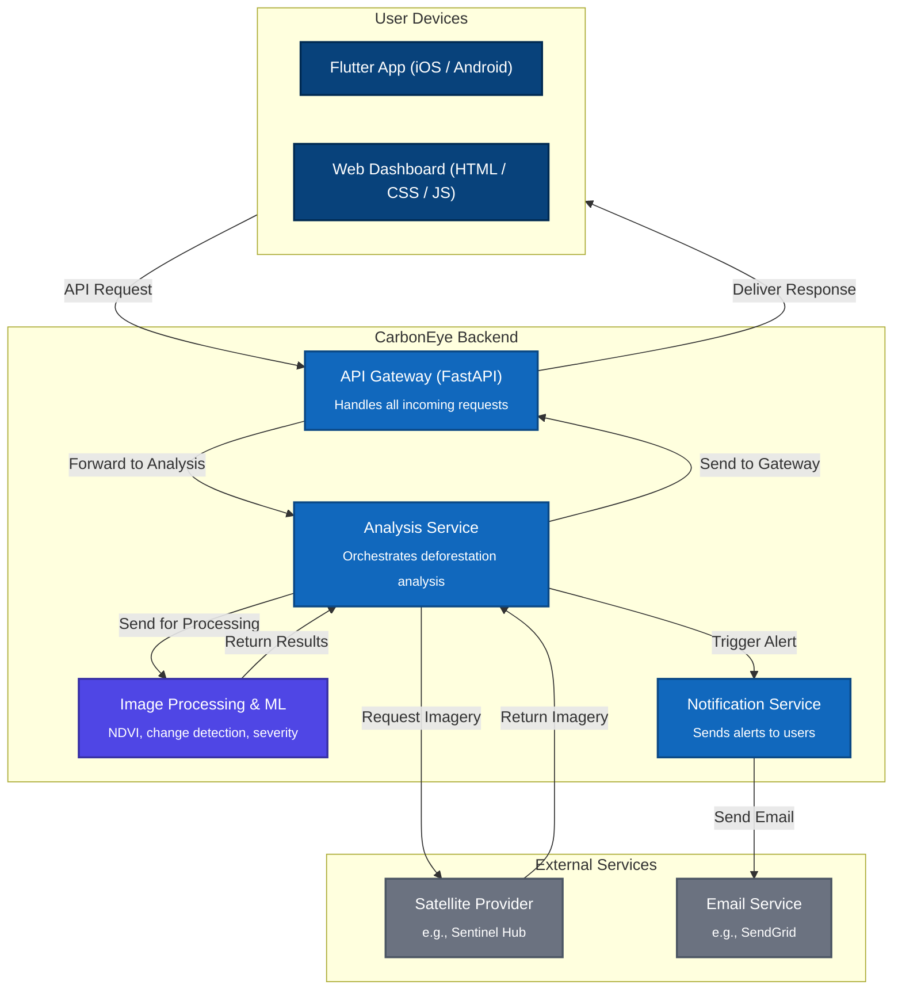

# CarbonEye: Real-Time Deforestation Monitoring Platform

**Eyes on the forest. Always.**

This README provides a comprehensive, full-stack guide to understanding, setting up, and running the entire CarbonEye platform. This includes the backend services, the cross-platform Flutter application, and the public-facing informational website.

## 📜 Project Overview

CarbonEye is a powerful tool designed to provide real-time intelligence on deforestation activities across the globe. By leveraging satellite imagery analysis, it empowers users to monitor specific regions, receive timely alerts, and generate detailed impact reports for environmental, social, and governance (ESG) purposes.

The platform consists of three main parts:

* **A powerful backend** built with Node.js, responsible for the heavy lifting of fetching and analyzing satellite data.
* **A cross-platform frontend application** built with Flutter, providing a rich, interactive user experience for analysis on mobile (iOS/Android) and the web.
* **An informational static website** built with HTML, CSS, and JavaScript, which serves as the public landing page, providing project details, team information, and the user dashboard.

## 🏛️ Full-Stack Architecture

The CarbonEye platform is built on a modern, decoupled architecture. The clients communicate with the backend via a REST API, allowing for independent development, deployment, and scaling of each component.



## ✨ Features

* **Cross-Platform Client:** A Flutter application for Android, iOS, and Web for in-depth analysis.
* **Public-Facing Website:** An informational website with project details, team bios, and a user dashboard.
* **Real-time Analysis:** On-demand deforestation analysis of user-selected regions.
* **Interactive Map Interface:** Users can pan, zoom, and select a bounding box to define an area for analysis.
* **Data Visualization:** Displays true-color and NDVI satellite imagery for "before" and "after" comparison.
* **Alerts & Watchlist:** Visualizes critical deforestation alerts on the map and allows users to save locations to a watchlist.
* **Annotation Tools:** Users can add timestamped notes and observations to their monitored regions.
* **Comprehensive PDF Reporting:** Generates professional PDF reports summarizing the analysis for ESG documentation.
* **Microservice-Ready Backend:** A scalable Node.js backend handles all data processing and analysis.

## 🚀 Technology Stack

| Component  | Technology/Package      | Description                                                 |
| :--------- | :---------------------- | :---------------------------------------------------------- |
| **Frontend** | **Flutter** | Cross-platform UI toolkit for the analysis application.     |
|            | `http`                  | For making API requests to the backend.                     |
|            | `flutter_map`           | For the interactive map interface.                          |
|            | `pdf` & `printing`      | To create and share PDF reports.                            |
|            | **HTML5, CSS3, JS (ES6)** | For the public-facing informational website and dashboard.  |
| **Backend** | **Node.js** | JavaScript runtime for the server.                          |
|            | **Express** | Web framework for Node.js, used for the API Gateway.        |
|            | `dotenv`                | For managing environment variables.                         |
|            | `cors`                  | For enabling Cross-Origin Resource Sharing.                 |
| **External** | **Sentinel Hub** | Provides the core satellite imagery data.                   |
|            | **SendGrid** | Example email provider for sending notifications.           |

## 🛠️ Full-Stack Setup and Installation

To run the complete CarbonEye platform, you must set up the backend and the desired frontend client(s).

### Prerequisites

* Node.js (v14 or higher) & npm
* Flutter SDK (v3.0 or higher) & Dart SDK
* An IDE like VS Code or Android Studio
* A Sentinel Hub account to obtain `CLIENT_ID` and `CLIENT_SECRET`

### 1. Backend Setup

First, set up and run the server.

1.  **Navigate to the backend directory**:
    ```bash
    cd carboneye/backend
    ```
2.  **Install backend dependencies**:
    ```bash
    npm install
    ```
3.  **Configure environment variables**:
    Create a `.env` file in the `backend` directory.
    ```
    CLIENT_ID='YOUR_SENTINEL_HUB_CLIENT_ID'
    CLIENT_SECRET='YOUR_SENTINEL_HUB_CLIENT_SECRET'
    PORT=3000
    ```

### 2. Frontend Setup

#### A. Flutter Application (for Mobile & Web Analysis)

Set up the cross-platform application.

1.  **Navigate to the project root directory**:
    ```bash
    cd carboneye
    ```
2.  **Install frontend dependencies**:
    ```bash
    flutter pub get
    ```
3.  **Configure the Backend URL**:
    Open the `lib/config.dart` file and update the `API_BASE_URL` to point to your backend.
    ```dart
    // lib/config.dart
    const String API_BASE_URL = 'http://<YOUR_LOCAL_IP_OR_HOSTNAME>:3000';
    ```
    > **Important:** When running on a mobile emulator/device, you **must** use your computer's local network IP address (e.g., `192.168.1.10`) instead of `localhost`.

#### B. Static Website (Informational Site & Dashboard)

The static website requires no build process. It is located in the `CarbonEye-anant` directory.

* **Structure**: The site is composed of standard HTML, CSS, and JavaScript files.
    * `index.html`: The main landing page.
    * `dashboard/`: Contains the user dashboard.
    * `about/`, `team/`, etc.: Informational sub-pages.
    * `style.css`, `script.js`: Main stylesheets and scripts.

## ▶️ Running the Full Application

1.  **Start the Backend Server**:
    In your terminal, from the `carboneye/backend` directory, run:
    ```bash
    npm start
    ```
    The server will start on port 3000 (or the port specified in your `.env` file).

2.  **Run the Frontend Application(s)**:
    * **Flutter App**: In a **new terminal**, from the root `carboneye` directory, select your target device (Chrome, Emulator, etc.) and run:
        ```bash
        flutter run
        ```
    * **Static Website**: Simply open the `CarbonEye-anant/index.html` file in your web browser. For full functionality (like API calls from the dashboard), it's best to serve the directory using a simple local server. If you have Python installed, you can run this from the `CarbonEye-anant` directory:
        ```bash
        # Python 3.x
        python -m http.server
        ```
        Then navigate to `http://localhost:8000` in your browser.

## ⚙️ Backend API Endpoints

### `/analyze-deforestation`

* **Method**: `POST`
* **Description**: Analyzes a specified region for deforestation.
* **Request Body**:
    ```json
    {
      "bbox": [ -62.41, -3.66, -62.01, -3.26 ]
    }
    ```
* **Success Response (200 OK)**: Returns a JSON object with true-color images, NDVI maps, alerts, and analysis summary.
* **Error Responses**: Returns `400` for invalid input or `500` for server errors.

## 📦 Building for Production

### Flutter Application

To create a release build of the application, use the following Flutter CLI commands from the project root.

* **Android (APK)**:
    ```bash
    flutter build apk --release
    ```
    The output will be located at `build/app/outputs/flutter-apk/app-release.apk`.
* **iOS**:
    ```bash
    flutter build ios --release
    ```
    This requires a configured Xcode environment.
* **Web**:
    ```bash
    flutter build web
    ```
    The compiled web application will be in the `build/web` directory.

### Static Website

The static website is already "built". To deploy it, simply copy the entire contents of the `CarbonEye-anant` directory to a static web hosting service (like Netlify, Vercel, or AWS S3).

## 📄 License

This project is licensed under the MIT License. See the `LICENSE` file for more details.
